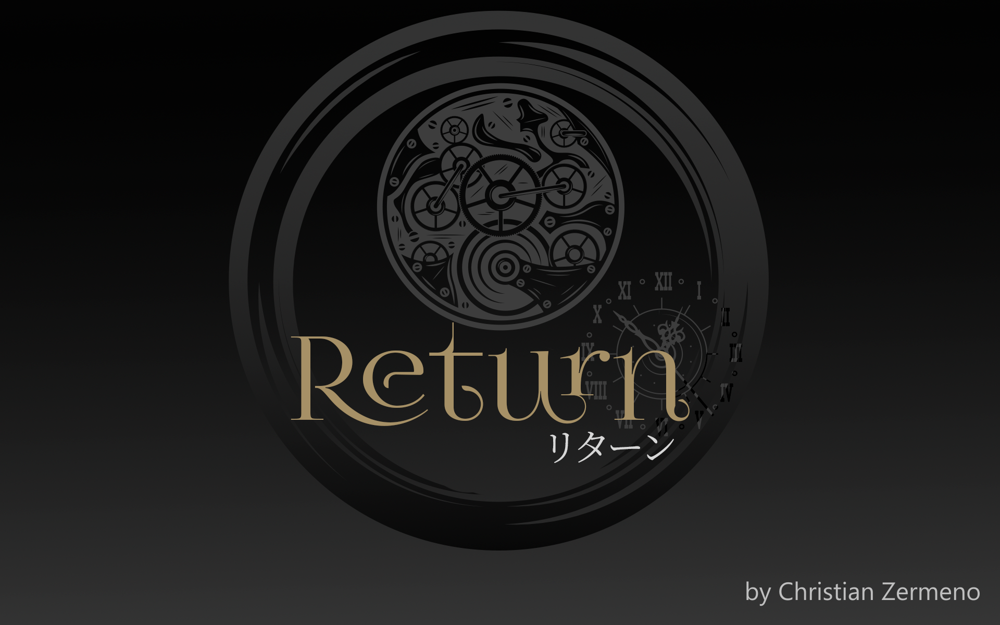
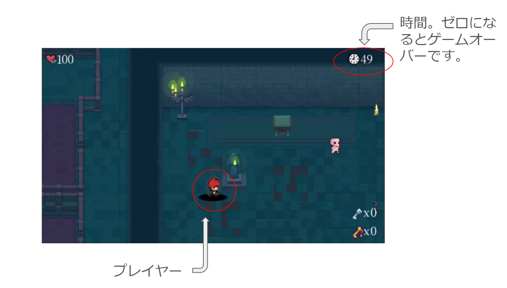
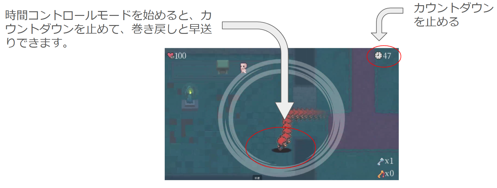
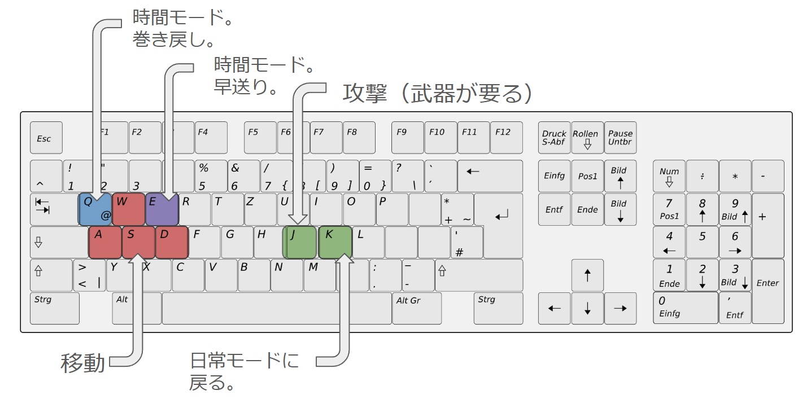
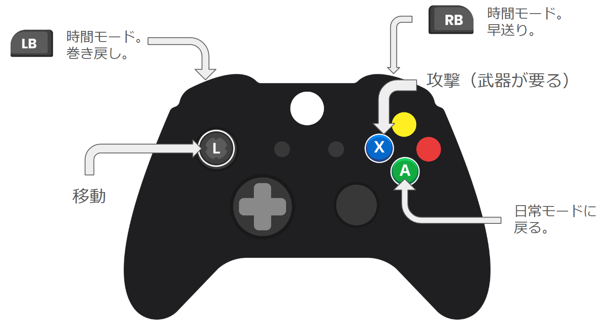
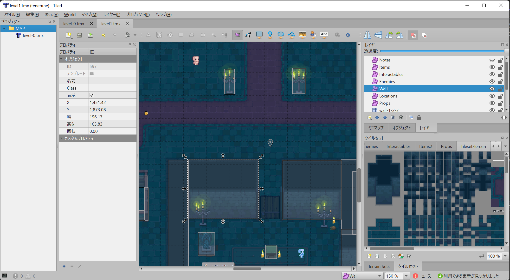
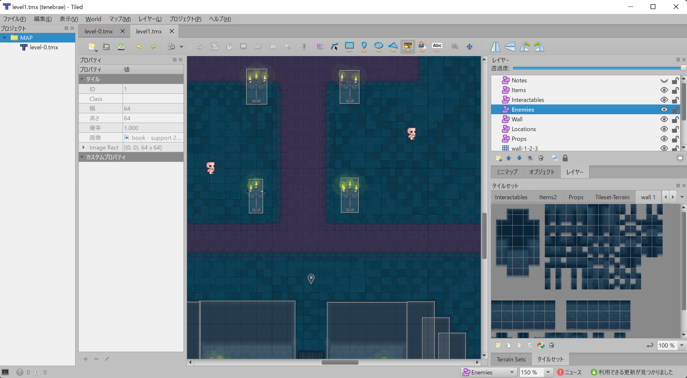
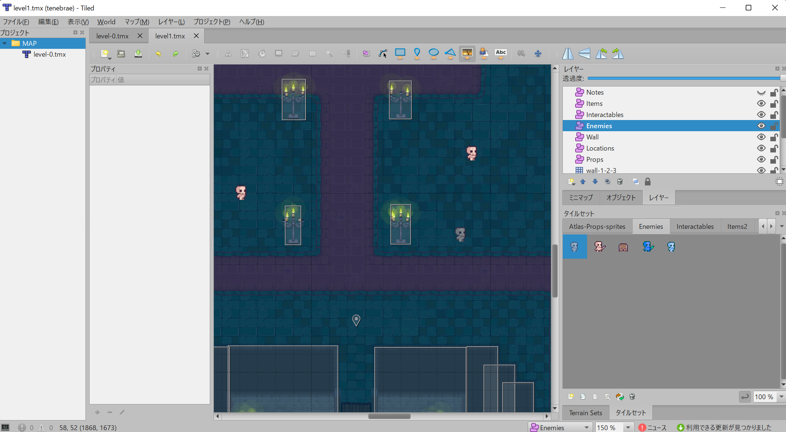

# リターン
DirectX 2D 時間操作できるARPGです。

このゲームは2024年のHAL夏の3校学内コンテストで技術賞を受賞しました。
その後、ブラッシュアップしてこのゲームで、2024年のHAL東京DirectXゲーム開発学内コンテストで銀賞を受賞しました。

リターンのゲームはタイムに関するゲームです。目的は制限時間が切れないうちにダンジョンから脱出しましょう。でも、時間が少なくて無理だそうなので、そのため、主人公はスペシャル時計を持って時間をコントロールできます。その時計の能力を使い過去と現在を行ききできます。

最初のレベルのクエストはダンジョン逃げる。アイテムはあちこちにあるのでちゃんと探さないといけません。

時間を戻しても集めたアイテム消えないので、安心してください。

## 操作説明　日常モード

## 操作説明　時間コントロールモード

## 操作説明　キーボード

## 操作説明 ゲームパッド　

## アピールポイント

このゲームは時間コントロールのため、タイムマシンのシステムが作られました。タイムマシンが毎秒30回ほどプレイヤーの動きを登録します。

タイムマシンの構造のおかげで簡単に他の物の動き登録することができます。現在のバージョンはプレイヤーの動きのみを登録します。

また、マップチップのサポートがあります。TiledMapという無料ソフトウェアのファイルをゲームに読み込むことができます。マップチップのタイルだけではなく、アイテムの情報もゲームに読み込むことができます。

以上の３つのアピールポイントにより、時間を戻してもアイテムやソウルなどを集めることができます。これにより、ゲームデザイナーが色々なパズル作ることができます。

## ビルド

### Microsoft Visual Studio 2022 

このゲームは「Visual Studio 2022 Community Edition」で作りました。
ソリューションファイルを「Visual Studio  2022」に開けた後、ビルドして、ゲームを実行してください。

## レベル編集

[Tiled](https://www.mapeditor.org/)というマップエディターでレベル編集できます。
レベルデータファイルは[data/TILEMAP/Crypt/level1.tmx](data/TILEMAP/Crypt/level1.tmx)です。

### 壁の当たり判定の編集

まず、Wallというレイヤーを選択して、オブジェクトツールを選んで、バウンディングボックスの一つをクリックしてください。その後、好きに調整してください。

バウンディングボックスの追加と削除もできます。

バウンディングボックスの追加の志望であれば、四角形を追加ツールを選択して、マップの上に好きにバウンディングボックスを作ってください。

終わった後セーブしてください。そのままでゲームの実行できます。

### エネミーやアイテムの編集

まず、EnemyまたはItemというレイヤーを選択して、オブジェクトツールを選んで、エネミーまたはアイテムの一つを選んでください。その後、好きに座標を調整してください。

追加の志望であれば、EnemyまたはItems2というタイルセットを選択して、好きなタイルを選んで、タイルを追加ツールを選択して、好きなマップの壁の当たり判定がない好きな場所にクリックしてください。

終わった後セーブしてください。

セーブした後、そのままでゲームを実行してください。

